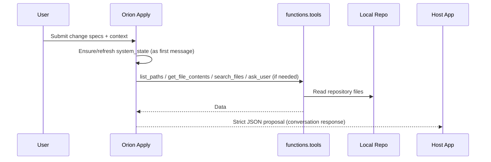
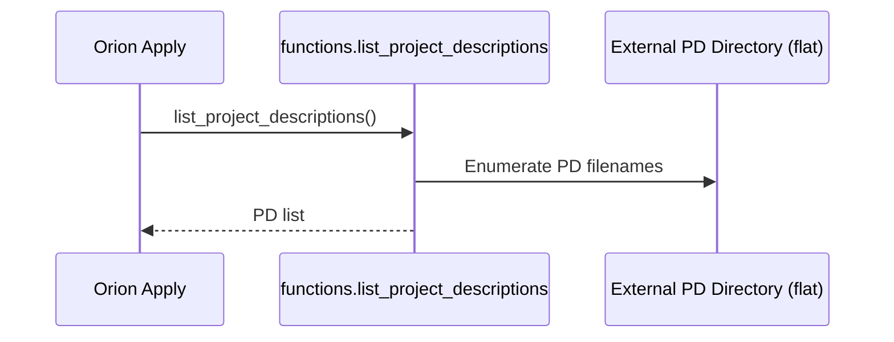
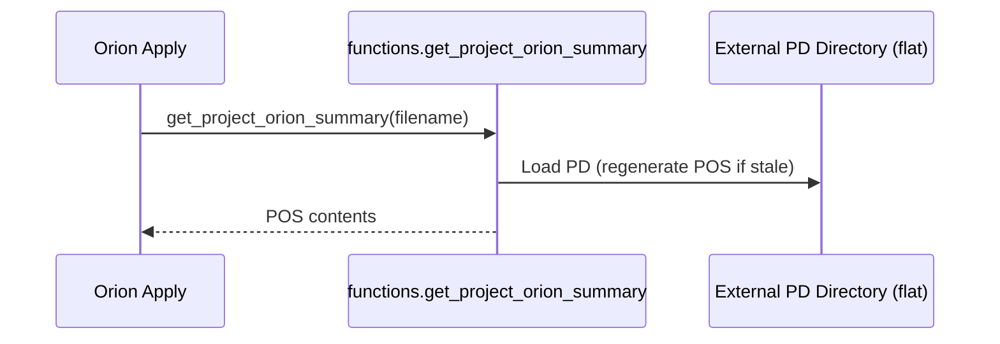

<!-- orion: Update Overview.md to match the repository on November 2, 2025. Removed deprecated tools (get_file_snippet, multi_tool_use.parallel), aligned data contracts with Pydantic models, documented system_state and apply-time promotion of full contents, refreshed configuration/env and CLI usage, and described post-apply split behavior. -->
# Repository Overview

This document explains the system architecture, core components, interaction flows, data contracts, configuration, and Mermaid diagrams for this repository. It reflects the codebase as of November 2, 2025.


<!-- orion: Tighten scope bullets to emphasize current tools, models, and flows, removing deprecated items. -->
## Purpose and Scope
- Describe how the assistant processes change specifications and repository contents to produce precise JSON patches.
- Clarify the current tool surface (functions namespace) and the external PD helpers available to the model.
- Document the authoritative system_state message, including apply-time promotion of affected files to full contents.
- Align data contracts with the centralized Pydantic models (ChangeType values, ConversationResponse, ApplyResponse).
- Capture configuration/env variables and CLI usage/commands.
- Note post-apply split behavior and provide updated diagrams.


<!-- orion: Update component list to match code: remove get_file_snippet and multi_tool_use.parallel; keep internal tools and explicit external PD tools. -->
## System Architecture
### Key Components
- Orion Apply Assistant
  - Reads change specs and current file contents via an authoritative system_state.
  - Optionally uses tools for repo inspection or external dependency summaries.
  - Produces a strict JSON response: mode, explanation, files (patches), and issues.
  - Inserts explanatory comments beginning with `orion:` just before each change made to files.
- Tooling Layer (functions namespace)
  - list_paths: Enumerate repo files (optionally by glob).
  - get_file_contents: Retrieve full file contents.
  - search_files: Search for substrings across files.
  - ask_user: Request clarifications from the user when needed.
  - External PD helpers (flat directory):
    - list_project_descriptions
    - get_project_orion_summary
- Host Application
  - Invokes the assistant and applies returned patches to the local repository.
  - Renders or post-processes the assistant’s JSON response.
- Target Repository (Local File System)
  - Contains the code and docs to be modified.
  - Receives updated files with `orion:` rationale comments embedded.


<!-- orion: Refresh diagram to remove multi_tool_use.parallel and deprecated tools; highlight system_state as authoritative. -->
### Architecture Diagram
```mermaid
flowchart LR
  U[User / Requestor] -->|Change Specs + Files| OA[Orion Apply]
  subgraph Tools[functions.* tools]
    LP[list_paths]
    GFC[get_file_contents]
    SC[search_files]
    AU[ask_user]
    LPD[list_project_descriptions]
    GPOS[get_project_orion_summary]
  end

  OA -->|calls| Tools
  Tools -->|read/write| REPO[(Local Repo)]
  Tools -->|PDs & POS| EXT[(External PD Directory)]

  OA -->|Strict JSON (mode, explanation, files, issues)| HOST[Host App]
  HOST -->|Apply patches| REPO

  OA -->|authoritative system_state| OA
```


<!-- orion: Document system_state structure and apply-time promotion of full contents, matching main.py behavior. -->
## Authoritative system_state
- The first message in every call is a persistent system_state JSON payload owned by Orion.
- It includes a version counter and a files map. Each entry is one of:
  - kind: "summary" — body contains a compact per-file summary JSON; meta.has_summary indicates presence.
  - kind: "full" — body contains the entire file text; meta includes line_count and bytes.
- On :apply, Orion promotes all affected paths to kind:"full" with the current contents and bumps the system_state version before the model call.

Example (abbreviated):
```
{
  "type": "system_state",
  "version": 2,
  "files": {
    "src/orion/workbench/main.py": {"kind": "summary", "body": {"...": "..."}, "meta": {"has_summary": true}},
    "Overview.md": {"kind": "full", "body": "<entire file>", "meta": {"line_count": 240, "bytes": 9700}}
  }
}
```


<!-- orion: Clarify end-to-end lifecycle with emphasis on system_state and promotion step. -->
## End-to-End Lifecycle
1. Input arrives containing change specs; Orion ensures a fresh system_state is the first message.
2. If more context is required, Orion calls tools (preferring minimal, batched usage).
3. For :apply, Orion promotes affected files to kind:"full" in system_state, bumps version, and asks the model for a strict ApplyResponse.
4. On success, the host app writes files, updates commit log, refreshes summaries for touched paths, and clears conversation/pending changes.


<!-- orion: Keep sequence diagram but annotate the system_state prefix and promotion during apply. -->
## Conversation Preview Flow (Sequence)



<!-- orion: Update apply sequence to show promotion to full contents and version bump. -->
## Apply Flow (Sequence)
```mermaid
sequenceDiagram
  participant H as Host App
  participant O as Orion Apply
  participant R as Local Repo

  O-->>O: Promote affected files to kind:"full" in system_state; bump version
  O-->>H: ApplyResponse JSON (mode, explanation, files, issues)
  H->>R: Write/modify files with `orion:` comments preceding changes
  H-->>O: Status (success / conflicts)
  O->>O: Refresh summaries for written paths; clear conversation/pending changes
```


<!-- orion: Summarization flows are current; keep as-is but clarify flat external PD directory. -->
## Summarization Flows
### List Project Descriptions (PDs)


### Get Project Orion Summary (POS)



<!-- orion: Align data contracts to Pydantic models: include full ChangeType enum, ConversationResponse, ApplyResponse. -->
## Data Contracts
### Input (Change Request)
- Change Specs: Array of change items
  - id: string
  - title: string
  - description: string
  - items: array of file-level intents, each with:
    - path: string
    - change_type: "modify" | "create" | "delete" | "move" | "rename"
    - summary_of_change: string
- Files: Array of current file payloads (typically empty because system_state carries contents)
  - path: string
  - content: string (entire file, if provided)

Example snippet:
```
{
  "changes": [
    {
      "id": "overview-doc-v1",
      "title": "Add comprehensive repository Overview with Mermaid diagrams",
      "description": "...",
      "items": [
        { "path": "Overview.md", "change_type": "modify", "summary_of_change": "..." }
      ]
    }
  ],
  "files": []
}
```

### ConversationResponse (model-driven)
```
{
  "assistant_message": "<string>",
  "changes": [ ChangeSpec, ... ]
}
```

### ApplyResponse (model-driven)
files is a list of FileContents items.
```
{
  "mode": "ok" | "incompatible",
  "explanation": "<string>",
  "files": [
    { "path": "<string>", "is_new": true|false, "contents": "<full file>" }
  ],
  "issues": [ { "reason": "<string>", "paths": ["<path>", ...] } ]
}
```

### Tool Call Parameters (current)
- list_paths: { glob?: string }
- get_file_contents: { path: string }
- search_files: { query: string, max_results?: number }
- ask_user: { prompt: string }
- list_project_descriptions: {}
- get_project_orion_summary: { filename: string }


<!-- orion: Update configuration/env to match config.py; remove ORION_EXTERNAL_DIR and document CLI external-dir. -->
## Configuration and Conventions
- Strict JSON Output
  - Always return a single JSON object with the prescribed fields.
- Rationale Comments
  - Insert `orion:` comments immediately before each change in code files where comments are syntactically supported. Do not insert them into prose (.md/.txt/.rst/.mdx/.html) or data formats (.json/.yaml/.toml/.csv). In those cases, provide reasoning only in ApplyResponse.explanation. If a prior `orion:` comment exists, update it.
- Tool Usage Policy
  - Prefer tools when additional context is needed; batch calls and avoid redundant fetches.
- Formatting Constraints
  - Default to minimal formatting unless the request explicitly asks for diagrams or rich formatting.
- Knowledge Cutoff and Dates
  - Be mindful of the assistant’s knowledge cutoff and current date context.
- Safety and Privacy
  - Do not include hidden reasoning in outputs. Use ask_user for sensitive or ambiguous cases.
- Error Handling
  - Use mode: "incompatible" if the request cannot be satisfied as asked. Provide reasons in issues.
- Timeouts and Idempotency
  - Keep tool calls deterministic where possible; retry or report clearly on failures.

### Conversation Prompt Customization (Project-level)
- Scope: Conversation turns only; :apply and :splitFile use their packaged prompts.
- Files (relative to repo root):
  - .orion/prompt_conversation_system.txt — primary override. If present and non-empty, Orion uses it verbatim as the conversation system prompt.
  - .orion/prompt_conversation_system.override.txt — secondary override. When the primary override is absent/empty, this replaces the packaged default prompt.
  - .orion/prompt_conversation_system.addendum.txt — addendum. When the primary override is absent/empty, this text is appended to the active base (packaged default or secondary override).
- Precedence:
  1) Use .orion/prompt_conversation_system.txt if present and non-empty.
  2) Otherwise start from the packaged default (src/orion/workbench/resources/prompt_conversation_system.txt). If .orion/prompt_conversation_system.override.txt exists and is non-empty, it replaces that base.
  3) Finally, if .orion/prompt_conversation_system.addendum.txt exists and is non-empty, append it to the base in step 2.
- Fallback: If none of the project-level files are present or they are empty/unreadable, Orion uses the packaged default prompt.
- Observability: Orion logs a short notice when a project-level override or addendum is applied.


<!-- orion: Add CLI usage and commands based on main(); include :clear-changes which exists even if not shown in :help. -->
## CLI Usage and Commands
Usage:
```
orion [--external-dir PATH|-e PATH] [repo_root]
```
Options:
- -e, --external-dir PATH  External Project Description directory (flat). When omitted, external dependency features are disabled.

Commands:
- :preview               Show pending changes
- :apply                 Apply all pending changes
- :discard-change <id>   Discard a pending change by id
- :refresh               Rescan repo and refresh summaries
- :refresh-deps          Refresh Project Orion Summaries for external dependencies
- :status                Show status summary
- :consolidate           Coalesce duplicate change batches
- :clear-changes         Clear all pending changes
- :help                  Show help
- :quit                  Exit


<!-- orion: Document post-apply split behavior tied to LINE_CAP and follow-up ChangeSpec generation. -->
## Post-apply Split Behavior
- After writing files, Orion checks each file’s line count.
- If lines exceed LINE_CAP, Orion enqueues a follow-up ChangeSpec to split the file:
  - First item: modify the original to reduce lines below LINE_CAP.
  - Second item: create a new file named with a _part2 suffix (same extension).
- The follow-up change is added to pending changes and persisted.


<!-- orion: Keep the quality checklist, trimming to items still relevant; remove deprecated references. -->
## Quality Checklist
- Requirements understood or clarified via ask_user.
- Relevant files discovered (list_paths/search_files) and retrieved as needed.
- Patches include updated content and `orion:` rationale comments (code files only).
- Output JSON validates against the expected schema.
- Issues array lists uncertainties or blockers.


<!-- orion: Shorten FAQ to reflect current toolset and guidance. -->
## FAQ
- When should I use ask_user?
  - When critical details are missing or ambiguous and cannot be inferred safely from context.
- What tools are available to the model?
  - list_paths, get_file_contents, search_files, ask_user, and the external PD helpers list_project_descriptions and get_project_orion_summary.
- How are file contents provided?
  - Via the authoritative system_state; on :apply, affected files are promoted to kind:"full" so the model sees exact text.
