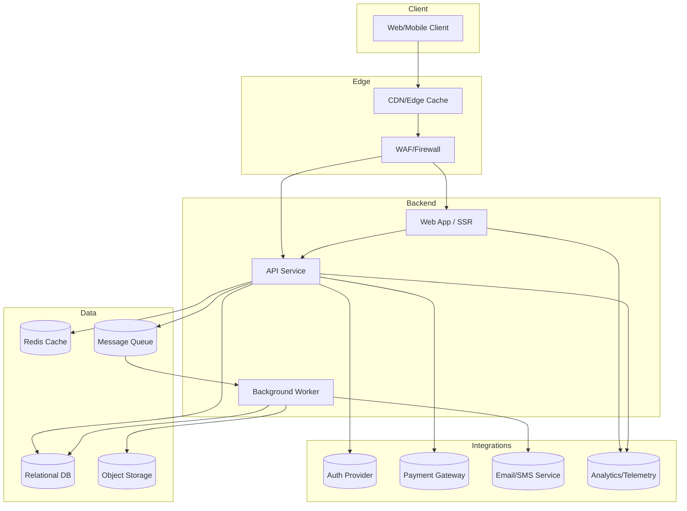
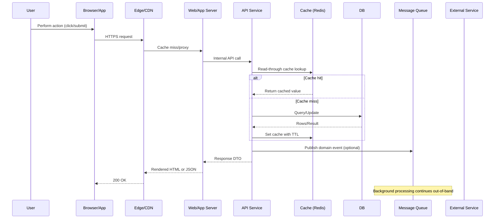
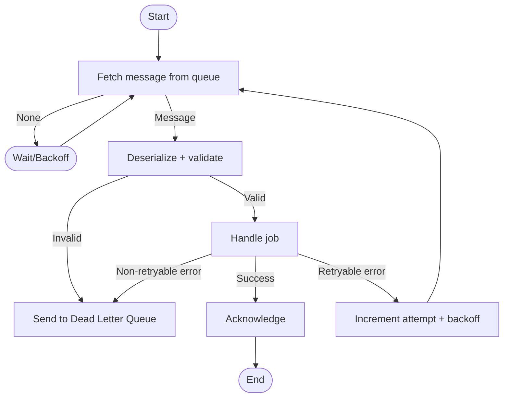
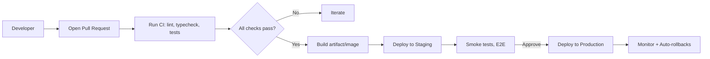

<!-- orion: Adding a top-level project overview to provide a shared mental model of architecture, workflows, configuration, and operations. Includes Mermaid diagrams (component map, flowcharts, sequence diagrams) as requested to make critical paths and responsibilities explicit. -->

# Project Overview

This document provides a concise, system-wide overview to help engineers, SREs, product, and stakeholders understand how the application is structured, how requests flow, where state lives, and how to configure and operate the system across environments.

Scope
- High-level architecture and responsibilities
- Core workflows (synchronous requests, background jobs, CI/CD)
- Configuration and environment management
- Observability, reliability, and security considerations
- Pointers for local development and extension

Note: This is a reference architecture template. Adapt names and components to match the actual services in this repository.

## 1) High-level Architecture

Purpose: Identify major components, their roles, and boundaries.

Key responsibilities
- Web: Server-side rendering (if applicable), static asset delivery, and coordinating client views.
- API: Business logic, validation, and data access. Publishes domain events.
- Worker: Consumes events/jobs, executes long-running or retryable tasks.
- DB: System of record for transactional data.
- Cache: Low-latency reads, ephemeral coordination, rate limiting.
- MQ: Decouples producers/consumers for asynchronous patterns.
- Object Storage: Binary assets, reports, exports.
- Integrations: Authentication, payments, notifications, analytics.

Environments
- Local: Developer workstations, mocked integrations.
- CI: Automated tests, linting, builds.
- Staging: Pre-production validation with production-like data shape.
- Production: User traffic, scale, and SLOs.

## 2) Request Lifecycle (Sync path)

Purpose: Show how a typical user request traverses the system and where data is cached or persisted.

Notes
- Prefer idempotent write endpoints; use request IDs to de-duplicate.
- Cache keys should include tenant/user-scoped namespaces when applicable.
- Publish events for side effects (emails, analytics, search indexing) to keep the request path fast.

## 3) Background Jobs and Event Handling

Purpose: Document reliability patterns (retries, DLQs) for asynchronous work.

Operational guidance
- Retries: Exponential backoff with jitter; cap attempts; observe idempotency.
- DLQ: Inspect, fix, and replay; alert on DLQ growth.
- Timeouts: Keep handler timeouts below queue visibility timeouts.

## 4) CI/CD Pipeline (from PR to Production)

Purpose: Clarify how code changes are tested, built, and deployed.

Best practices
- Immutable images, pinned dependencies, SBOM generation.
- Progressive delivery (canary/blue-green) with health checks.
- Automated database migrations with safe rollout and rollback plans.

## 5) Configuration and Secrets

Principles
- Configuration is code: declarative, versioned defaults; environment overrides.
- Twelve-Factor: Use environment variables; do not commit secrets.
- Consistent precedence: Default config < environment-specific < environment variables < runtime flags.

Configuration sources
- Environment variables: e.g.,
  - APP_ENV (local|ci|staging|prod)
  - APP_PORT (e.g., 8080)
  - DATABASE_URL (Postgres connection string)
  - REDIS_URL
  - QUEUE_URL
  - OBJECT_STORAGE_BUCKET
  - EXTERNAL_AUTH_DOMAIN / CLIENT_ID / CLIENT_SECRET
  - FEATURE_FLAGS (JSON or provider key)
  - LOG_LEVEL (debug|info|warn|error)
- Files: config/*.yaml or .env files for local only (never in production).
- Secret manager: e.g., AWS Secrets Manager, GCP Secret Manager, Vault.

Runtime configuration patterns
- Read-only config snapshot at boot; hot-reload only where safe.
- Validate early; fail-fast with clear errors.
- Redact sensitive values in logs and diagnostics.

## 6) Data and Schema

- Primary store: Relational DB for transactional integrity (ACID). Use migrations.
- Caching: Redis for hot keys; define TTLs and invalidation strategies.
- Object storage: Large binaries, exports, and assets with signed URLs.
- Event data: Prefer append-only event logs or analytics sinks for BI.

## 7) Observability and Operations

- Logging: Structured, JSON logs with correlation IDs (trace_id, span_id, request_id, user_id).
- Metrics: RED/USE metrics for services; SLI/SLO definitions for latency, error rate, and availability.
- Tracing: Distributed tracing across Web, API, Worker, and external calls.
- Dashboards: Per-service views for health, saturation, and errors.
- Alerting: Page on user-impacting symptoms; ticket on non-urgent issues.

Runbooks
- Incident response steps, rollback procedures, feature-flag kill switches.
- On-call quick links: dashboards, logs, tracing, feature flag console, DLQ browser.

## 8) Security and Compliance

- Authentication: External IdP or first-party auth; tokens with short TTLs; refresh flows.
- Authorization: Role/attribute-based checks enforced in API and UI.
- Secrets: Managed in a secure store; rotated regularly; principle of least privilege.
- Data protection: At-rest encryption for DB/object storage; TLS in transit.
- Input validation: Schema validation at boundaries; output encoding for UI.
- Auditing: Critical actions logged with immutable, tamper-evident storage where required.

## 9) Local Development

- Prerequisites: Docker, language runtime, package manager.
- Suggested workflow
  - Clone repo and copy .env.example to .env (local only).
  - Start dependencies via docker-compose or dev containers.
  - Run application services (web/api/worker) locally with hot reload.
  - Seed minimal data and run smoke tests.

- Common commands (adapt to this repo)
  - make dev          # start app + dependencies
  - make test         # run unit/integration tests
  - make migrate      # apply database migrations

## 10) Extension and Integration Points

- Domain events: Publish/subscribe contracts for decoupled features.
- Webhooks: Inbound/outbound patterns with signature validation and retries.
- Feature flags: Progressive delivery and safe experimentation.
- Modules/services: Clear ownership, SLAs, and error budgets.

## 11) Glossary

- API Service: The stateless service exposing business endpoints.
- Worker: Asynchronous processor for queued jobs and events.
- DLQ: Dead Letter Queue for messages that repeatedly fail.
- SLO: Service Level Objective; target for reliability.
- Canary: Partial traffic rollout to test new versions safely.
