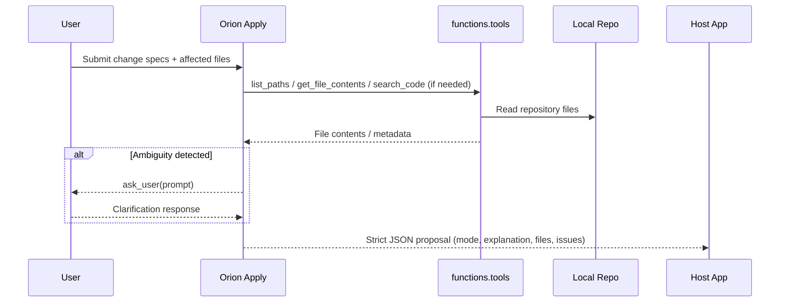
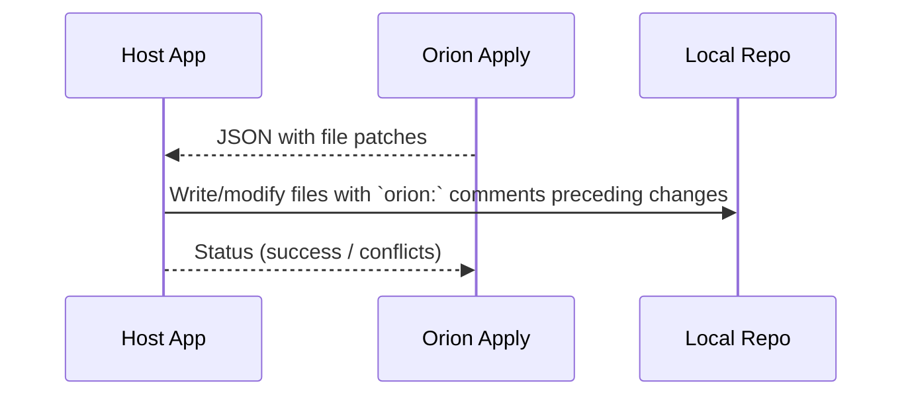
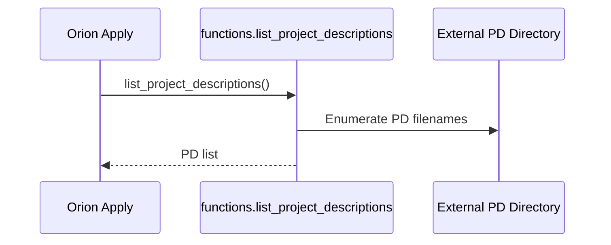
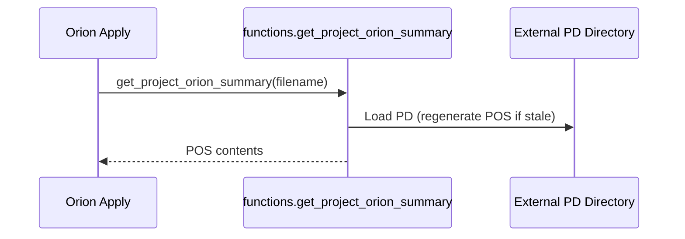

<!-- orion: Adding a comprehensive repository overview with architecture, processes, data contracts, configuration, and Mermaid diagrams to guide contributors and tools. This fulfills the request to populate Overview.md with a clear end-to-end description and visualizations. -->
# Repository Overview

This document explains the system architecture, core components, interaction flows, data contracts, configuration knobs, and safety constraints for this repository. It also embeds Mermaid diagrams to visualize conversation, apply, and summarization processes.


<!-- orion: Providing a concise purpose section to orient readers quickly and establish scope. -->
## Purpose and Scope
- Describe how the assistant processes change specifications and repository contents to produce precise JSON patches.
- Clarify the roles of tools (functions namespace) and the multi_tool_use wrapper for parallel calls.
- Document the strict output contract and the requirement to include `orion:` rationale comments in code changes.
- Visualize the system with Mermaid diagrams for faster comprehension.


<!-- orion: Detailing the system architecture and responsibilities helps maintainers and tool users understand where logic runs and how data flows. -->
## System Architecture
### Key Components
- Orion Apply Assistant
  - Reads change specs and current file contents.
  - Optionally calls tools to gather more context.
  - Produces a strict JSON response: mode, explanation, files (patches), and issues.
  - Inserts explanatory comments beginning with `orion:` just before each change made to files.
- Tooling Layer (functions namespace)
  - list_paths: Enumerate repo files (optionally by glob).
  - get_file_contents: Retrieve full file contents.
  - get_file_snippet: Retrieve line-ranged snippets.
  - search_code: Search for substrings across files.
  - ask_user: Request clarifications when requirements are ambiguous or missing.
  - list_project_descriptions: List external Project Descriptions (PDs).
  - get_project_orion_summary: Retrieve a Project Orion Summary (POS) for a PD.
- Multi-tool wrapper
  - multi_tool_use.parallel: Execute multiple tool calls concurrently when safe, improving latency.
- Host Application
  - Invokes the assistant and applies returned patches to the local repository.
  - Renders or post-processes the assistant’s JSON response.
- Target Repository (Local File System)
  - Contains the code and docs to be modified.
  - Receives updated files with `orion:` rationale comments embedded.


<!-- orion: Including a high-level architecture flowchart to visualize actors, tools, and data stores at a glance. -->
### Architecture Diagram
```mermaid
flowchart LR
  U[User / Requestor] -->|Change Specs + Files| OA[Orion Apply]
  subgraph Tools[functions.* tools]
    LP[list_paths]
    GFC[get_file_contents]
    GFS[get_file_snippet]
    SC[search_code]
    AU[ask_user]
    LPD[list_project_descriptions]
    GPOS[get_project_orion_summary]
  end

  OA -->|calls| Tools
  Tools -->|read/write| REPO[(Local Repo)]
  Tools -->|PDs & POS| EXT[(External Project Descriptions)]

  OA -->|Strict JSON (mode, explanation, files, issues)| HOST[Host App]
  HOST -->|Apply patches| REPO
```


<!-- orion: Outlining the end-to-end lifecycle provides context for when and why each tool is used and how outputs are consumed. -->
## End-to-End Lifecycle
1. Input arrives containing change specs and the current contents of affected files.
2. The assistant evaluates whether more context is required; if so, it calls tools (possibly in parallel) to fetch files, snippets, or project summaries.
3. If requirements are ambiguous, the assistant may use ask_user to clarify.
4. The assistant generates a strict JSON response including file patches with `orion:` comments and any issues detected.
5. The host app applies the patches to the repository and reports results.


<!-- orion: Adding a sequence diagram for the conversation/preview flow to illustrate interactive steps and optional clarifications. -->
## Conversation Preview Flow (Sequence)



<!-- orion: Showing the apply sequence to clarify how patches are materialized and where the `orion:` rationale comments appear. -->
## Apply Flow (Sequence)



<!-- orion: Visualizing summarization flows to document how PDs and POS are obtained for cross-project awareness. -->
## Summarization Flows
### List Project Descriptions (PDs)


### Get Project Orion Summary (POS)



<!-- orion: Defining strict data contracts reduces ambiguity and prevents schema drift between the assistant and the host app. -->
## Data Contracts
### Input (Change Request)
- Change Specs: Array of change items
  - id: string
  - title: string
  - description: string
  - items: array of file-level intents, each with:
    - path: string
    - change_type: "modify" | "add" | "delete"
    - summary_of_change: string
- Files: Array of current file payloads
  - path: string
  - content: string (entire file, if provided)

Example snippet:
```
{
  "changes": [
    {
      "id": "overview-doc-v1",
      "title": "Add comprehensive repository Overview with Mermaid diagrams",
      "description": "...",
      "items": [
        { "path": "Overview.md", "change_type": "modify", "summary_of_change": "..." }
      ]
    }
  ],
  "files": [ { "path": "Overview.md", "content": "" } ]
}
```

### Output (Assistant Response)
- mode: "ok" | "incompatible"
- explanation: string (human-readable summary)
- files: array of file patches
  - path: string
  - is_new: boolean
  - code: string (full file contents after applying changes)
- issues: array of discovered issues
  - reason: string
  - paths: array<string>

Example snippet:
```
{
  "mode": "ok",
  "explanation": "...",
  "files": [
    { "path": "Overview.md", "is_new": false, "code": "<file content>" }
  ],
  "issues": []
}
```

### Tool Call Parameters (selected)
- list_paths: { glob?: string }
- get_file_contents: { path: string }
- get_file_snippet: { path: string, start_line: number, end_line: number }
- search_code: { query: string, max_results?: number }
- ask_user: { prompt: string }
- list_project_descriptions: {}
- get_project_orion_summary: { filename: string }
- multi_tool_use.parallel: { tool_uses: Array<{ recipient_name: "functions.<tool>", parameters: object }>} (parallelizable only)


<!-- orion: Clarifying configuration knobs ensures predictable behavior across environments and use cases. -->
## Configuration and Conventions
- Strict JSON Output
  - Always return a single JSON object with the prescribed fields.
- Rationale Comments
  - Insert `orion:` comments immediately before each change in code/doc files. If a prior `orion:` comment exists, update it to reflect new reasoning.
- Tool Usage Policy
  - Prefer tools when additional context is needed. Use multi_tool_use.parallel when calls can safely run concurrently.
- Formatting Constraints
  - Default to minimal formatting unless the request explicitly asks for diagrams or rich formatting (as in this document).
- Knowledge Cutoff and Dates
  - Be mindful of the assistant’s knowledge cutoff and current date context.
- Safety and Privacy
  - Do not include hidden reasoning in outputs. Use ask_user for sensitive or ambiguous cases.
- Error Handling
  - Use mode: "incompatible" if the request cannot be satisfied as asked. Provide reasons in issues.
- Timeouts and Idempotency
  - Keep tool calls deterministic where possible; retry or report clearly on failures.


<!-- orion: Providing a quick checklist helps maintain quality and consistency for future changes. -->
## Quality Checklist
- Requirements understood or clarified via ask_user.
- Relevant files discovered (list_paths/search_code) and retrieved.
- Patches include updated content and `orion:` rationale comments.
- Output JSON validates against the expected schema.
- Issues array lists uncertainties or blockers.


<!-- orion: Offering a brief FAQ to address recurring contributor questions and prevent misuse. -->
## FAQ
- When should I use ask_user?
  - When critical details are missing or ambiguous and cannot be inferred safely from context.
- When is multi_tool_use.parallel appropriate?
  - When multiple independent tool calls can run concurrently (e.g., fetching contents of several files).
- What if a file already contains an `orion:` comment?
  - Update the existing comment to reflect the latest reasoning for that change rather than adding duplicates.
